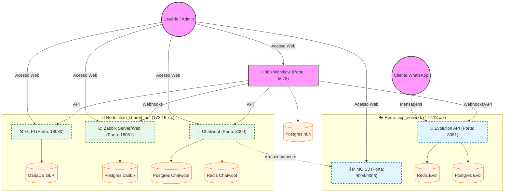

# 🚀 Stack ITSM, Monitoramento & Automação (GLPI + Zabbix + Chatwoot + Evolution API)

Este repositório contém a infraestrutura completa, orquestrada via Docker Compose, para uma suíte de Gestão de Serviços de TI (ITSM), Monitoramento de Infraestrutura e Atendimento Omnichannel.

O projeto foi desenhado para ser modular, escalável e seguro, utilizando segmentação de redes e persistência de dados.

---

## 📋 Índice
1. [Arquitetura da Solução](#-arquitetura-da-solução)
2. [Fluxograma de Dados](#-fluxograma-de-dados)
3. [Componentes da Stack](#-componentes-da-stack)
4. [Pré-requisitos](#-pré-requisitos)
5. [Instalação e Deploy](#-instalação-e-deploy)
6. [Pós-Instalação (Setup Inicial)](#-pós-instalação-setup-inicial)
7. [Estrutura de Diretórios](#-estrutura-de-diretórios)
8. [Troubleshooting](#-troubleshooting)

---

## 🏛 Arquitetura da Solução

A infraestrutura é dividida em **duas redes virtuais** isoladas para garantir segurança e organização lógica do tráfego:

1.  **`app_network` (Frontend/Integration):**
    *   Focada na camada de borda e integrações externas (WhatsApp).
    *   Contém: Evolution API, MinIO e a "perna" de entrada do n8n.
2.  **`itsm_shared_net` (Backend/Management):**
    *   Focada nas aplicações de gestão interna.
    *   Contém: GLPI, Zabbix, Chatwoot e a "perna" de saída do n8n.

O **n8n** atua como o **Hub de Integração**, sendo o único serviço conectado a ambas as redes, permitindo que eventos externos (ex: mensagem no WhatsApp) disparem ações internas (ex: abrir ticket no GLPI ou criar conversa no Chatwoot), sem expor os serviços internos diretamente à camada de API pública.

---

## 🔄 Fluxograma de Dados

Abaixo, o diagrama detalhado das conexões, redes e fluxo de dados entre os serviços.



---

## 🧩 Componentes da Stack

### 1. **GLPI (v11.0.1)**
*   **Função:** Service Desk, Gestão de Ativos (CMDB) e Rastreamento de Problemas.
*   **Imagem:** `glpi/glpi:11.0.1`
*   **Banco:** MariaDB 10.11

### 2. **Chatwoot (v4.8.0)**
*   **Função:** Plataforma de atendimento ao cliente (Live Chat, WhatsApp, Email).
*   **Imagem:** `chatwoot/chatwoot:v4.8.0` (Edição Community)
*   **Recursos:** Suporte a `pgvector` para funcionalidades de IA.

### 3. **Zabbix (v7.0 LTS)**
*   **Função:** Monitoramento de redes, servidores e aplicações em tempo real.
*   **Imagem:** Alpine based (leve e segura).

### 4. **Evolution API (Latest)**
*   **Função:** Gateway para conexão com o WhatsApp (baseado na biblioteca Baileys).
*   **Recursos:** Multi-sessão, envio de mídia, webhooks.

### 5. **n8n**
*   **Função:** Orquestrador de automação "Low-code". Conecta todos os serviços acima.

### 6. **MinIO**
*   **Função:** Object Storage compatível com S3.
*   **Uso:** Armazenamento centralizado de arquivos (anexos do Chatwoot, backups).

---

## ⚙️ Pré-requisitos

Para rodar esta stack, seu servidor deve atender aos requisitos mínimos:

*   **Sistema Operacional:** Linux (Ubuntu 22.04+ recomendado) ou Windows (com WSL2).
*   **Docker:** Versão 24.0+
*   **Docker Compose:** Versão 2.20+
*   **Hardware Recomendado:**
    *   **CPU:** 4 vCPUs
    *   **RAM:** 8GB+ (O Zabbix e GLPI juntos consomem consideravelmente, e o Java do Elasticsearch [se adicionado futuramente] demandaria mais).
    *   **Disco:** 50GB SSD livre.

---

## 🚀 Instalação e Deploy

1.  **Clone o Repositório:**
    ```bash
    git clone https://seu-git/projeto-itsm.git
    cd projeto-itsm
    ```

2.  **Configuração de Ambiente (.env):**
    O arquivo `.env` na raiz contém todas as senhas e chaves. **ALTERE AS SENHAS PADRÃO** antes de subir em produção.
    ```bash
    # Exemplo de variáveis críticas
    POSTGRES_PASSWORD=sua_senha_segura
    MINIO_ROOT_PASSWORD=sua_senha_minio
    SECRET_KEY_BASE=gere_uma_hash_longa_para_o_chatwoot
    ```

3.  **Iniciar a Stack:**
    Utilizamos um arquivo `compose.yaml` central que importa os módulos individuais.
    ```bash
    docker compose up -d
    ```

4.  **Verificar Status:**
    ```bash
    docker compose ps
    ```
    *Aguarde alguns minutos até que todos os serviços estejam com status `(healthy)`.*

---

## 🛠 Pós-Instalação (Setup Inicial)

Após subir os containers, você precisa finalizar a configuração via navegador:

### 1. Chatwoot (`http://localhost:3000`)
*   Acesse a URL.
*   Crie a conta de administrador (email/senha).
*   *Nota: O banco já foi inicializado via script.*

### 2. GLPI (`http://localhost:18080`)
*   Selecione o idioma.
*   Aceite a licença.
*   **Instalar** > Verificar requisitos.
*   **Configuração do Banco:**
    *   Servidor: `glpi-db`
    *   Usuário: `glpi_user`
    *   Senha: (ver no .env, padrão `sua_senha_glpi_db`)
*   Selecione o banco `glpi_db`.

### 3. Zabbix (`http://localhost:18081`)
*   **Database Host:** `zabbix-db`
*   **Database Name:** `zabbix_db`
*   **User:** `zabbix_user`
*   **Password:** (ver no .env, padrão `sua_senha_zabbix_db`)

### 4. Evolution API (`http://localhost:8081`)
*   A API é "Headless" (sem interface visual nativa complexa). Use o **n8n** ou Postman para interagir.
*   **Global API Key:** Definida no `.env` (`AUTHENTICATION_API_KEY`).

---

## 📂 Estrutura de Diretórios

```plaintext
/
├── compose.yaml          # Arquivo mestre de orquestração
├── .env                  # Variáveis de ambiente globais
├── README.md             # Esta documentação
│
├── Chatwoot/
│   ├── compose.yaml      # Definição do serviço Chatwoot
│   └── .env              # Variáveis específicas do Chatwoot
│
├── GLPI/
│   ├── glpi.yml          # Definição do serviço GLPI + MariaDB
│   └── .env              # Variáveis específicas
│
├── Zabbix/
│   └── zabbix.yml        # Definição do Zabbix Server/Web/Agent
│
├── evolution/
│   └── compose.yaml      # Definição da API de WhatsApp
│
├── n8n/
│   └── compose.yaml      # Definição do n8n + Redis/Postgres dedicados
│
└── minio/
    └── compose.yaml      # Definição do Object Storage
```

---

## 🔧 Troubleshooting

### Chatwoot não mostra tela de cadastro
Execute o reset forçado do banco de dados (CUIDADO: Apaga dados do Chatwoot):
```bash
docker compose -f Chatwoot/compose.yaml down -v
docker compose -f Chatwoot/compose.yaml up -d
docker compose -f Chatwoot/compose.yaml exec web bundle exec rails db:create db:schema:load db:seed
```

### Erro de Conexão no Banco (GLPI/Zabbix)
Verifique se o container do banco está saudável:
```bash
docker compose ps | grep db
```
Se o banco reiniciar em loop, verifique os logs:
```bash
docker compose logs glpi-db
```
*Geralmente é erro de senha ou permissão de volume.*

### Portas Ocupadas
Se receber erro `Bind for 0.0.0.0:8080 failed: port is already allocated`, edite o `.env` ou os arquivos `compose.yaml` para alterar a porta externa (ex: mudar `18080:80` para `18081:80`).
